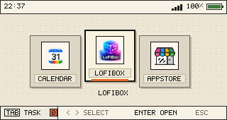

# cardputer-zero-shell

`cardputer-zero-shell` is the post-login GUI shell for Cardputer Zero.

中文定义：

`cardputer-zero-shell` 是用户登录成功之后运行的 Zero 小屏图形 Shell。它不是
OS，不是登录器，不是 PAM 组件，不负责系统定制，也不以 root 身份运行用户桌面。

它负责：

- 显示 Zero 小屏 launcher；
- 扫描 APPLaunch 兼容的 `.desktop` 文件；
- 启动用户选择的应用；
- 在 Wayland/labwc 模式下展示 compositor 可见的 running tasks；
- 作为 Wayland client 请求窗口激活；
- 保持和 `cardputer-zero-os` 的边界清晰。

它不负责：

- 创建用户；
- 保存密码；
- PAM 认证；
- greetd/LightDM/systemd 登录服务；
- udev 权限；
- DRM/KMS overlay；
- HDMI 登录；
- polkit 策略；
- app store 后端；
- 普通 Linux 桌面的完整窗口管理。

## Current UI



截图来自测试设备的真实运行状态。ZeroShell 不再捆绑假应用来填充菜单；它只显示
系统中实际安装到 APPLaunch 目录的 desktop entries。

## Why This Exists

旧 `M5CardputerZero-Launcher` 把很多职责混在一起：启动器 UI、内置页面、应用
扫描、系统控制、root/service 风格逻辑、历史路径和 AppStore 假设。ZeroShell
把其中“登录后的图形启动器能力”抽出来，并让 OS/login/permission/window
management 回到更合适的层级。

正确边界是：

```text
cardputer-zero-os
  boot splash / greeter / PAM via greetd / logind session / DRM-KMS-labwc / permissions / zero-helper

cardputer-zero-shell
  launcher UI / APPLaunch scan / app launch / task UI frontend

applications
  their own windows and domain UI
```

ZeroShell 的目标不是成为一个自制窗口管理器。当前技术路径是把任务切换放回
Linux 标准图形栈：

```text
Zero internal ST7789 display
  -> DRM/KMS output
  -> labwc compositor
  -> Wayland or Xwayland application windows
  -> ZeroShell as launcher/task UI client
```

这意味着 ZeroShell 负责“显示任务列表和请求激活”，而 labwc 负责真正的窗口焦点、
最小化、关闭和层叠。

## Runtime Modes

There are two implementation modes in this repository.

### Wayland/labwc Mode

This is the current production direction used by the verified device setup.

```text
cardputer-zero-os
  -> authenticated user session
  -> /usr/local/bin/cardputer-zero-labwc-session
  -> labwc on /dev/dri/cardputer-zero-internal
  -> /opt/cardputer-zero-shell/bin/zero-shell-wayland
```

In this mode:

- ZeroShell is a Wayland client;
- it draws through shared-memory Wayland buffers;
- it does not open `/dev/fb0` or `/dev/fb1`;
- labwc owns the internal display;
- apps must create Wayland or Xwayland windows to be manageable tasks;
- the running task panel is based on compositor toplevels from `wlrctl`;
- short/long Esc policy is handled by `cardputer-zero-os` input policy, not by
  ZeroShell alone.

### Legacy: Direct Framebuffer Mode

The original MVP still exists as an explicit compatibility mode:

```text
/opt/cardputer-zero-shell/bin/zero-shell
```

It opens the internal framebuffer directly and runs its own input loop. This is
useful for early bring-up and recovery, but it is not the long-term multitasking
model.

In framebuffer mode, `Terminal=true` apps can be handled by ZeroShell's internal
PTY page, but ordinary graphical apps are blocking foreground processes. There
is no standard compositor window to minimize or restore.

## Full Wayland/labwc Timing

Once the user logs in through `cardputer-zero-os`, the normal timing is:

```text
greetd/PAM authenticates existing Linux user
  -> cardputer-zero-session
  -> cardputer-zero-labwc-session
  -> labwc starts on the internal SPI DRM output
  -> labwc -S starts zero-shell-wayland
  -> ZeroShell scans /usr/share/APPLaunch/applications/*.desktop
  -> user selects an app and presses Enter
  -> ZeroShell launches Exec non-blocking
  -> application creates a Wayland/Xwayland toplevel
  -> labwc manages the app window
  -> ZeroShell sees the toplevel through wlrctl
  -> running badge/task panel can show it
```

When a foreground app owns keyboard focus:

```text
Tab
  -> labwc keybind calls zero-shell-control tasks
  -> ZeroShell toggles RUNNING TASKS

short Esc
  -> zero-key-policy calls zero-shell-control minimize-active
  -> wlrctl minimizes the active toplevel
  -> ZeroShell is focused

long Esc
  -> zero-key-policy calls zero-shell-control close-active
  -> wlrctl asks the active toplevel to close
  -> ZeroShell is focused
```

This is why Esc handling is not purely inside ZeroShell: a normal Wayland client
does not receive global key events while another client has focus.

## Application Contract

ZeroShell keeps the APPLaunch directory contract:

```text
/usr/share/APPLaunch/applications/*.desktop
```

It intentionally does not scan:

```text
/usr/share/applications
```

That prevents the small-screen launcher from being flooded by normal desktop
applications that were not designed for the Zero device.

Minimal entry:

```ini
[Desktop Entry]
Name=LoFiBox
Exec=lofibox
TryExec=lofibox
Terminal=false
Icon=share/images/lofibox.png
Sysplause=false
X-Zero-Display=xwayland
StartupWMClass=lofibox
```

Supported fields:

| Field | Meaning |
| --- | --- |
| `Name` | Display name. |
| `Exec` | Command launched by ZeroShell. |
| `Icon` | Icon path. Relative `share/...` paths resolve under `/usr/share/APPLaunch`. |
| `TryExec` | Hide the entry when the command is unavailable. |
| `Terminal` | Legacy framebuffer terminal-page hint. |
| `Sysplause` | Legacy post-command pause hint. |
| `X-Zero-ShortName` | Optional short launcher label. |
| `StartupWMClass` | X11/Xwayland matching hint. |
| `X-Zero-AppId` | Wayland app_id matching hint. |
| `X-Zero-Display` | Wayland/labwc display contract: `wayland`, `xwayland`, or `framebuffer`. |

The Wayland/labwc shell only launches entries that explicitly declare a windowed display mode:

```ini
X-Zero-Display=wayland
```

or:

```ini
X-Zero-Display=xwayland
```

Reason: a direct framebuffer app started inside labwc can fight the compositor
for the same internal display and cause flicker. If an app is still direct-fb
only, mark it as:

```ini
X-Zero-Display=framebuffer
```

or leave the field unset until it has a windowed build.

## Task Model

In the Wayland/labwc session, a task is a compositor-managed toplevel/window.

It is not primarily:

- a PID;
- a shell wrapper;
- a process group;
- a `.desktop` file;
- a `Terminal=true` session.

Those are metadata. The task exists when labwc can see a window.

ZeroShell currently reads task state with:

```sh
wlrctl toplevel list
```

and activates tasks with:

```sh
wlrctl toplevel focus app_id:<id>
wlrctl toplevel focus title:<title>
```

This is intentionally a small integration with the compositor layer. Long-term,
a direct Wayland foreign-toplevel protocol client or a small OS-side window
agent would be cleaner than parsing command output, but the concept is the same:
tasks come from compositor windows.

## LoFiBox And AppStore Guidance

In the current verified session, LoFiBox can run as an Xwayland app through the
normal `lofibox` command. That is acceptable as a transition because labwc can
manage the resulting window.

Long-term, LoFiBox and AppStore should become Wayland-native or at least keep a
windowed Xwayland/SDL/GTK/Qt backend. The important thing is not "Wayland at all
costs"; the important thing is:

```text
the app creates a compositor-visible window
```

Direct framebuffer builds such as a `*_zero_device` binary are legacy/device
compatibility modes. They should not be the default launch target in the
Wayland/labwc session.

Wayland-native apps should set a stable app_id, for example:

```text
io.github.cardputerzero.lofibox
```

That lets ZeroShell match the window back to the `.desktop` entry and show the
correct icon/running badge.

## User Controls

Wayland/labwc home:

| Key | Behavior |
| --- | --- |
| `Left` / `Right` | Select app. |
| `Enter` | Launch selected app. |
| `Tab` | Toggle running task panel. |
| `R` | Reload APPLaunch directory. |

Wayland/labwc running task panel:

| Key | Behavior |
| --- | --- |
| `Up` / `Down` | Select task. |
| `Enter` | Focus selected task through labwc. |
| `Tab` / `Esc` | Hide task panel. |

Global app policy, implemented by `cardputer-zero-os`:

| Key | Behavior |
| --- | --- |
| Short `Esc` | Minimize active app window and return to ZeroShell. |
| Long `Esc` | Request close on active app window and return to ZeroShell. |

## File Map

### Entry Points

| File | Role |
| --- | --- |
| `README.md` | This overview and mechanism guide. |
| `CMakeLists.txt` | Builds both `zero-shell` and `zero-shell-wayland`. Generates xdg-shell protocol code with `wayland-scanner`. |
| `install.sh` | Builds and installs both shell binaries into `/opt/cardputer-zero-shell/bin`. Creates APPLaunch data directories but does not install fake apps. |
| `uninstall.sh` | Removes installed shell files. |

### Shared Application/Data Code

| File | Role |
| --- | --- |
| `main/include/zero_shell/app_catalog.hpp` | Defines `AppEntry` and the APPLaunch scan API. Includes Wayland/labwc metadata fields such as `StartupWMClass`, `X-Zero-AppId`, and `X-Zero-Display`. |
| `main/src/app_catalog.cpp` | Parses APPLaunch `.desktop` files, applies `TryExec`, resolves app metadata, and returns launchable entries. |
| `main/include/zero_shell/image.hpp` / `main/src/image.cpp` | PNG loading and image data used by both UI paths. |
| `main/include/zero_shell/status.hpp` / `main/src/status.cpp` | Reads basic time, WiFi, and battery status. |

### Legacy Framebuffer Shell

| File | Role |
| --- | --- |
| `main/src/main.cpp` | Entry point for the direct framebuffer `zero-shell` binary. |
| `main/include/zero_shell/framebuffer_canvas.hpp` / `main/src/framebuffer_canvas.cpp` | Opens and draws to the internal framebuffer. |
| `main/include/zero_shell/input_device.hpp` / `main/src/input_device.cpp` | Reads Linux evdev keyboard input. |
| `main/include/zero_shell/shell_ui.hpp` / `main/src/shell_ui.cpp` | Legacy framebuffer carousel, power menu, and terminal-task UI. |
| `main/include/zero_shell/pty_terminal.hpp` / `main/src/pty_terminal.cpp` | Minimal PTY terminal page for `Terminal=true` entries in framebuffer mode. |
| `main/include/zero_shell/process_runner.hpp` / `main/src/process_runner.cpp` | Blocking process launch and restricted helper calls in framebuffer mode. |

### Wayland Shell

| File | Role |
| --- | --- |
| `main/src/zero_shell_wayland.cpp` | Wayland client backend. Draws the 320x170 launcher with shared-memory buffers, sets app_id `cardputer-zero-shell`, scans APPLaunch entries, launches windowed apps non-blocking, polls `wlrctl` task state, renders `RUNNING TASKS`, and reads the command file written by `zero-shell-control`. |
| generated `xdg-shell-client-protocol.h` | Built at compile time from `xdg-shell.xml`. |
| generated `xdg-shell-protocol.c` | Built at compile time from `xdg-shell.xml`. |

### Documentation

| File | Role |
| --- | --- |
| `docs/intent.md` | Business intent and boundary. |
| `docs/relationship-to-os.md` | Split between OS profile and Shell. |
| `docs/application-contract.md` | APPLaunch `.desktop` contract. |
| `docs/runtime.md` | Runtime identity, display modes, and environment. |
| `docs/spec.md` | Implementation specification. |
| `docs/user-guide.md` | User-facing controls and behavior. |
| `docs/wayland-task-model.md` | Wayland/labwc window/task model. |
| `docs/development.md` | Development notes. |
| `docs/assets/*` | Reference screenshots and visual assets. |

## Build

Required packages on the target:

```sh
sudo apt-get install build-essential cmake pkg-config libpng-dev \
  libwayland-dev wayland-protocols
```

Build:

```sh
cmake -S . -B build
cmake --build build
```

Outputs:

```text
build/zero-shell
build/zero-shell-wayland
```

`install.sh` can fall back to direct compiler invocation if CMake is not
available, but the Wayland build still needs `wayland-scanner`, `xdg-shell.xml`,
and `libwayland-client`.

## Install

```sh
sudo ./install.sh
```

Installs:

```text
/opt/cardputer-zero-shell/bin/zero-shell
/opt/cardputer-zero-shell/bin/zero-shell-wayland
/usr/share/APPLaunch/applications
/usr/share/APPLaunch/share/images
```

It does not configure:

- systemd;
- greetd;
- PAM;
- LightDM;
- udev;
- users;
- autologin;
- app entries.

Those belong to `cardputer-zero-os` or to each app package.

ZeroShell also does not ship fake/default applications. An app appears only when
its package installs an APPLaunch desktop entry.

## Verify

Check the process identity:

```sh
ps -eo user,pid,args | grep zero-shell
```

Expected Wayland/labwc shape:

```text
pi  /opt/cardputer-zero-shell/bin/zero-shell-wayland
```

Check compositor-visible tasks:

```sh
XDG_RUNTIME_DIR=/run/user/1000 WAYLAND_DISPLAY=wayland-0 wlrctl toplevel list
```

Example:

```text
cardputer-zero-shell: Cardputer Zero Shell
: LoFiBox Zero
```

If an app is visible on screen but does not appear in `wlrctl toplevel list`, it
is probably not a compositor-managed window. It may still be drawing directly to
the framebuffer, and ZeroShell/labwc cannot standardly minimize or restore it.

## Relationship To cardputer-zero-os

`cardputer-zero-os` provides:

- boot splash;
- internal greeter;
- greetd/PAM/logind session;
- DRM/KMS and labwc setup;
- `zero-key-policy`;
- `zero-shell-control`;
- `zero-helper`;
- polkit agent;
- device permissions;
- recovery surface.

`cardputer-zero-shell` provides:

- launcher UI;
- APPLaunch app discovery;
- non-blocking launch in the Wayland/labwc session;
- running task panel;
- compositor task activation requests.

That split is intentional. It keeps Shell from becoming an OS service and keeps
OS from growing app-specific launcher behavior.

## Documentation Index

- [docs/intent.md](docs/intent.md)
- [docs/relationship-to-os.md](docs/relationship-to-os.md)
- [docs/application-contract.md](docs/application-contract.md)
- [docs/runtime.md](docs/runtime.md)
- [docs/spec.md](docs/spec.md)
- [docs/user-guide.md](docs/user-guide.md)
- [docs/wayland-task-model.md](docs/wayland-task-model.md)
- [docs/install.md](docs/install.md)
- [docs/development.md](docs/development.md)
